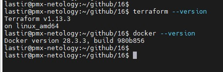
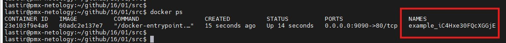

# Домашнее задание к занятию «Введение в Terraform»

### Цели задания

1. Установить и настроить Terrafrom.
2. Научиться использовать готовый код.

------

### Чек-лист готовности к домашнему заданию

1. Скачайте и установите **Terraform** версии >=1.12.0 . Приложите скриншот вывода команды ```terraform --version```.
2. Скачайте на свой ПК этот git-репозиторий. Исходный код для выполнения задания расположен в директории **01/src**.
3. Убедитесь, что в вашей ОС установлен docker.


## Решение



------

### Инструменты и дополнительные материалы, которые пригодятся для выполнения задания

1. Репозиторий с ссылкой на зеркало для установки и настройки Terraform: [ссылка](https://github.com/netology-code/devops-materials).
2. Установка docker: [ссылка](https://docs.docker.com/engine/install/ubuntu/). 
------
### Внимание!! Обязательно предоставляем на проверку получившийся код в виде ссылки на ваш github-репозиторий!
------

### Задание 1

1. Перейдите в каталог [**src**](https://github.com/netology-code/ter-homeworks/tree/main/01/src). Скачайте все необходимые зависимости, использованные в проекте. 
2. Изучите файл **.gitignore**. В каком terraform-файле, согласно этому .gitignore, допустимо сохранить личную, секретную информацию?(логины,пароли,ключи,токены итд)
3. Выполните код проекта. Найдите  в state-файле секретное содержимое созданного ресурса **random_password**, пришлите в качестве ответа конкретный ключ и его значение.
4. Раскомментируйте блок кода, примерно расположенный на строчках 29–42 файла **main.tf**.
Выполните команду ```terraform validate```. Объясните, в чём заключаются намеренно допущенные ошибки. Исправьте их.
5. Выполните код. В качестве ответа приложите: исправленный фрагмент кода и вывод команды ```docker ps```.
6. Замените имя docker-контейнера в блоке кода на ```hello_world```. Не перепутайте имя контейнера и имя образа. Мы всё ещё продолжаем использовать name = "nginx:latest". Выполните команду ```terraform apply -auto-approve```.
Объясните своими словами, в чём может быть опасность применения ключа  ```-auto-approve```. Догадайтесь или нагуглите зачем может пригодиться данный ключ? В качестве ответа дополнительно приложите вывод команды ```docker ps```.
8. Уничтожьте созданные ресурсы с помощью **terraform**. Убедитесь, что все ресурсы удалены. Приложите содержимое файла **terraform.tfstate**. 
9. Объясните, почему при этом не был удалён docker-образ **nginx:latest**. Ответ **ОБЯЗАТЕЛЬНО НАЙДИТЕ В ПРЕДОСТАВЛЕННОМ КОДЕ**, а затем **ОБЯЗАТЕЛЬНО ПОДКРЕПИТЕ** строчкой из документации [**terraform провайдера docker**](https://docs.comcloud.xyz/providers/kreuzwerker/docker/latest/docs).  (ищите в классификаторе resource docker_image )

## Решение 1

1. 

2. personal.auto.tfvars

3. "result": "iC4Hxe30FQcXGGjE"

4. В первом ресурсе  "docker_image" нет имени ресурса, во втором ресурсе "docker_container" "1nginx" имя написано с ошибкой, так как имя должно начинаться с цифры или знака подчеркивания. В этом же ресурсе указана ссылка на образ docker_image.nginx.image_id. что указывает на имякоторое надо задать у первого ресурса.
После исправления названий terraform validate указал на ошибки в ссылке на ресурс random_password.random_string.result (было указано random_password.random_string_FAKE.resulT добавлено _FAKE в названии ресурса и T вместо t в названии ключа)

5.
```
resource "docker_image" "nginx" {
  name         = "nginx:latest"
  keep_locally = true
}

resource "docker_container" "nginx" {
  image = docker_image.nginx.image_id
  name  = "example_${random_password.random_string.result}"

  ports {
    internal = 80
    external = 9090
  }
}
```
```
lastir@pmx-netology:~/github/16/01/src$ docker ps
CONTAINER ID   IMAGE          COMMAND                  CREATED          STATUS          PORTS                  NAMES
23e103f9e4a6   60adc2e137e7   "/docker-entrypoint.…"   15 seconds ago   Up 14 seconds   0.0.0.0:9090->80/tcp   example_iC4Hxe30FQcXGGjE

```


6. Так как применяется автоматически, то могут быть риски потери ресурсов, изменения данных, потере работоспособности инфраструктуры.
Применяться может скорее всего в CI/CD для автоматического применения изменений.
```
CONTAINER ID   IMAGE          COMMAND                  CREATED         STATUS         PORTS                  NAMES
99774bca4480   60adc2e137e7   "/docker-entrypoint.…"   3 minutes ago   Up 3 minutes   0.0.0.0:9090->80/tcp   hello_world

```
7. 
```
{
  "version": 4,
  "terraform_version": "1.13.3",
  "serial": 11,
  "lineage": "8f5f122c-f01c-4922-182a-4cc90d473d0a",
  "outputs": {},
  "resources": [],
  "check_results": null
}

```
8. Описание ресурса содержит  keep_locally = true
```
keep_locally (Boolean) If true, then the Docker image won't be deleted on destroy operation. If this is false, it will delete the image from the docker local storage on destroy operation.
```

------

## Дополнительное задание (со звёздочкой*)

**Настоятельно рекомендуем выполнять все задания со звёздочкой.** Они помогут глубже разобраться в материале.   
Задания со звёздочкой дополнительные, не обязательные к выполнению и никак не повлияют на получение вами зачёта по этому домашнему заданию. 

### Задание 2*

1. Создайте в облаке ВМ. Сделайте это через web-консоль, чтобы не слить по незнанию токен от облака в github(это тема следующей лекции). Если хотите - попробуйте сделать это через terraform, прочитав документацию yandex cloud. Используйте файл ```personal.auto.tfvars``` и гитигнор или иной, безопасный способ передачи токена!
2. Подключитесь к ВМ по ssh и установите стек docker.
3. Найдите в документации docker provider способ настроить подключение terraform на вашей рабочей станции к remote docker context вашей ВМ через ssh.
4. Используя terraform и  remote docker context, скачайте и запустите на вашей ВМ контейнер ```mysql:8``` на порту ```127.0.0.1:3306```, передайте ENV-переменные. Сгенерируйте разные пароли через random_password и передайте их в контейнер, используя интерполяцию из примера с nginx.(```name  = "example_${random_password.random_string.result}"```  , двойные кавычки и фигурные скобки обязательны!) 
```
    environment:
      - "MYSQL_ROOT_PASSWORD=${...}"
      - MYSQL_DATABASE=wordpress
      - MYSQL_USER=wordpress
      - "MYSQL_PASSWORD=${...}"
      - MYSQL_ROOT_HOST="%"
```

6. Зайдите на вашу ВМ , подключитесь к контейнеру и проверьте наличие секретных env-переменных с помощью команды ```env```. Запишите ваш финальный код в репозиторий.

## Решение 2
конфиги

[vm](./task2/vm/)

[docker](./task2/)


### Задание 3*
1. Установите [opentofu](https://opentofu.org/)(fork terraform с лицензией Mozilla Public License, version 2.0) любой версии
2. Попробуйте выполнить тот же код с помощью ```tofu apply```, а не terraform apply.

## Решение 3
```
Apply complete! Resources: 3 added, 0 changed, 0 destroyed.
lastir@pmx-netology:~/github/16/01/task2/vm$ tofu --version
OpenTofu v1.10.7
on linux_amd64
+ provider registry.terraform.io/yandex-cloud/yandex v0.172.0
lastir@pmx-netology:~/github/16/01/task2/vm$ cd ../..
lastir@pmx-netology:~/github/16/01$ cd task3
lastir@pmx-netology:~/github/16/01/task3$
lastir@pmx-netology:~/github/16/01/task3$ tofu init

Initializing the backend...

Initializing provider plugins...
- Finding kreuzwerker/docker versions matching "~> 3.6.1"...
- Finding latest version of hashicorp/random...
╷
│ Error: Failed to resolve provider packages
│
│ Could not resolve provider kreuzwerker/docker: could not connect to registry.opentofu.org: failed to request discovery document: 403 Forbidden
╵

╷
│ Error: Failed to resolve provider packages
│
│ Could not resolve provider hashicorp/random: could not connect to registry.opentofu.org: failed to request discovery document: 403 Forbidden
╵

lastir@pmx-netology:~/github/16/01/task3$
```
------

### Правила приёма работы

Домашняя работа оформляется в отдельном GitHub-репозитории в файле README.md.   
Выполненное домашнее задание пришлите ссылкой на .md-файл в вашем репозитории.

### Критерии оценки

Зачёт ставится, если:

* выполнены все задания,
* ответы даны в развёрнутой форме,
* приложены соответствующие скриншоты и файлы проекта,
* в выполненных заданиях нет противоречий и нарушения логики.

На доработку работу отправят, если:

* задание выполнено частично или не выполнено вообще,
* в логике выполнения заданий есть противоречия и существенные недостатки. 

