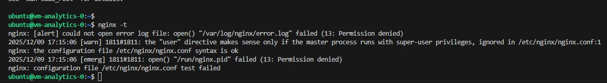
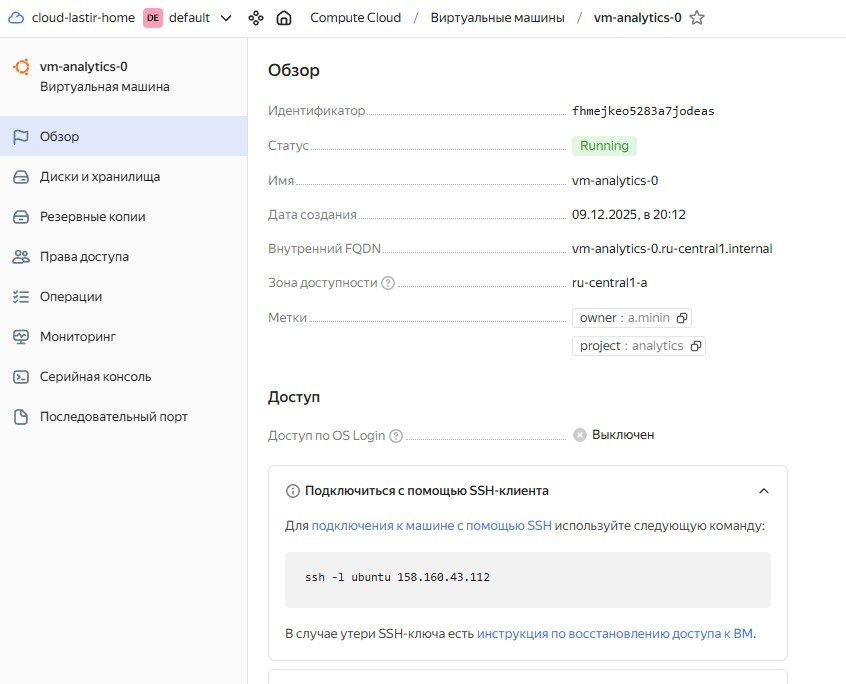
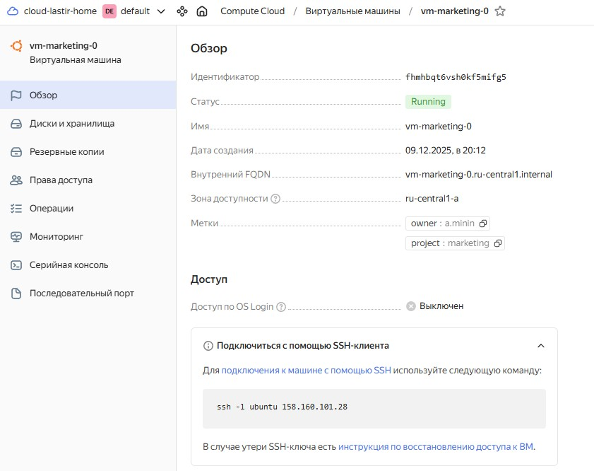
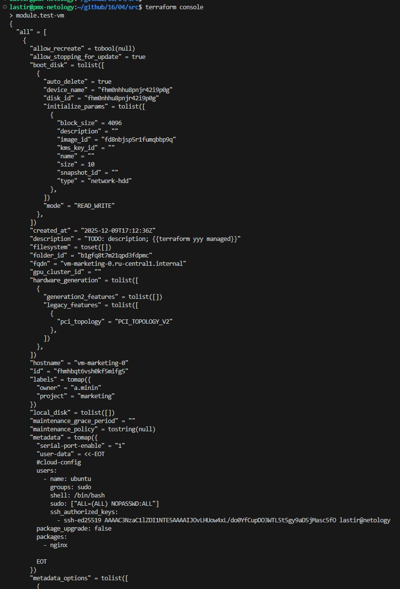

# Домашнее задание к занятию «Продвинутые методы работы с Terraform»

### Цели задания

1. Научиться использовать модули.
2. Отработать операции state.
3. Закрепить пройденный материал.


### Чек-лист готовности к домашнему заданию

1. Зарегистрирован аккаунт в Yandex Cloud. Использован промокод на грант.
2. Установлен инструмент Yandex CLI.
3. Исходный код для выполнения задания расположен в директории [**04/src**](https://github.com/netology-code/ter-homeworks/tree/main/04/src).
4. Любые ВМ, использованные при выполнении задания, должны быть прерываемыми, для экономии средств.

------
### Внимание!! Обязательно предоставляем на проверку получившийся код в виде ссылки на ваш github-репозиторий!
Убедитесь что ваша версия **Terraform** ~>1.12.0
Пишем красивый код, хардкод значения не допустимы!
------

### Задание 1

1. Возьмите из [демонстрации к лекции готовый код](https://github.com/netology-code/ter-homeworks/tree/main/04/demonstration1) для создания с помощью двух вызовов remote-модуля -> двух ВМ, относящихся к разным проектам(marketing и analytics) используйте labels для обозначения принадлежности.  В файле cloud-init.yml необходимо использовать переменную для ssh-ключа вместо хардкода. Передайте ssh-ключ в функцию template_file в блоке vars ={} .
Воспользуйтесь [**примером**](https://grantorchard.com/dynamic-cloudinit-content-with-terraform-file-templates/). Обратите внимание, что ssh-authorized-keys принимает в себя список, а не строку.
3. Добавьте в файл cloud-init.yml установку nginx.
4. Предоставьте скриншот подключения к консоли и вывод команды ```sudo nginx -t```, скриншот консоли ВМ yandex cloud с их метками. Откройте terraform console и предоставьте скриншот содержимого модуля. Пример: > module.marketing_vm

### Решение 1





```
lastir@pmx-netology:~/github/16/04/src$ terraform console
> module.test-vm
{
  "all" = [
    {
      "allow_recreate" = tobool(null)
      "allow_stopping_for_update" = true
      "boot_disk" = tolist([
        {
          "auto_delete" = true
          "device_name" = "fhm0nhhu8pnjr42i9p0g"
          "disk_id" = "fhm0nhhu8pnjr42i9p0g"
          "initialize_params" = tolist([
            {
              "block_size" = 4096
              "description" = ""
              "image_id" = "fd8nbjsp5r1fumqbbp9q"
              "kms_key_id" = ""
              "name" = ""
              "size" = 10
              "snapshot_id" = ""
              "type" = "network-hdd"
            },
          ])
          "mode" = "READ_WRITE"
        },
      ])
      "created_at" = "2025-12-09T17:12:36Z"
      "description" = "TODO: description; {{terraform yyy managed}}"
      "filesystem" = toset([])
      "folder_id" = "b1gfq8t7m21qpd3fdpmc"
      "fqdn" = "vm-marketing-0.ru-central1.internal"
      "gpu_cluster_id" = ""
      "hardware_generation" = tolist([
        {
          "generation2_features" = tolist([])
          "legacy_features" = tolist([
            {
              "pci_topology" = "PCI_TOPOLOGY_V2"
            },
          ])
        },
      ])
      "hostname" = "vm-marketing-0"
      "id" = "fhmhbqt6vsh0kf5mifg5"
      "labels" = tomap({
        "owner" = "a.minin"
        "project" = "marketing"
      })
      "local_disk" = tolist([])
      "maintenance_grace_period" = ""
      "maintenance_policy" = tostring(null)
      "metadata" = tomap({
        "serial-port-enable" = "1"
        "user-data" = <<-EOT
        #cloud-config
        users:
          - name: ubuntu
            groups: sudo
            shell: /bin/bash
            sudo: ["ALL=(ALL) NOPASSWD:ALL"]
            ssh_authorized_keys:
              - ssh-ed25519 AAAAC3NzaC1lZDI1NTE5AAAAIJOvLHUow4xL/do0YfCupDO3WTL5t5gy9aD5jMasc5fO lastir@netology
        package_upgrade: false
        packages:
          - nginx
        
        EOT
      })
      "metadata_options" = tolist([
        {
          "aws_v1_http_endpoint" = 1
          "aws_v1_http_token" = 2
          "gce_http_endpoint" = 1
          "gce_http_token" = 1
        },
      ])
      "name" = "vm-marketing-0"
      "network_acceleration_type" = "standard"
      "network_interface" = tolist([
        {
          "dns_record" = tolist([])
          "index" = 0
          "ip_address" = "10.0.1.9"
          "ipv4" = true
          "ipv6" = false
          "ipv6_address" = ""
          "ipv6_dns_record" = tolist([])
          "mac_address" = "d0:0d:11:5e:ba:6f"
          "nat" = true
          "nat_dns_record" = tolist([])
          "nat_ip_address" = "158.160.101.28"
          "nat_ip_version" = "IPV4"
          "security_group_ids" = toset(null) /* of string */
          "subnet_id" = "e9bimtrdglk0m8jphush"
        },
      ])
      "placement_policy" = tolist([
        {
          "host_affinity_rules" = tolist([])
          "placement_group_id" = ""
          "placement_group_partition" = 0
        },
      ])
      "platform_id" = "standard-v1"
      "resources" = tolist([
        {
          "core_fraction" = 5
          "cores" = 2
          "gpus" = 0
          "memory" = 1
        },
      ])
      "scheduling_policy" = tolist([
        {
          "preemptible" = true
        },
      ])
      "secondary_disk" = toset([])
      "service_account_id" = ""
      "status" = "running"
      "timeouts" = null /* object */
      "zone" = "ru-central1-a"
    },
  ]
  "external_ip_address" = [
    "158.160.101.28",
  ]
  "fqdn" = [
    "vm-marketing-0.ru-central1.internal",
  ]
  "internal_ip_address" = [
    "10.0.1.9",
  ]
  "labels" = [
    tomap({
      "owner" = "a.minin"
      "project" = "marketing"
    }),
  ]
  "network_interface" = [
    tolist([
      {
        "dns_record" = tolist([])
        "index" = 0
        "ip_address" = "10.0.1.9"
        "ipv4" = true
        "ipv6" = false
        "ipv6_address" = ""
        "ipv6_dns_record" = tolist([])
        "mac_address" = "d0:0d:11:5e:ba:6f"
        "nat" = true
        "nat_dns_record" = tolist([])
        "nat_ip_address" = "158.160.101.28"
        "nat_ip_version" = "IPV4"
        "security_group_ids" = toset(null) /* of string */
        "subnet_id" = "e9bimtrdglk0m8jphush"
      },
    ]),
  ]
}
>  
```

------
В случае использования MacOS вы получите ошибку "Incompatible provider version" . В этом случае скачайте remote модуль локально и поправьте в нем версию template провайдера на более старую.
------

### Задание 2

1. Напишите локальный модуль vpc, который будет создавать 2 ресурса: **одну** сеть и **одну** подсеть в зоне, объявленной при вызове модуля, например: ```ru-central1-a```.
2. Вы должны передать в модуль переменные с названием сети, zone и v4_cidr_blocks.
3. Модуль должен возвращать в root module с помощью output информацию о yandex_vpc_subnet. Пришлите скриншот информации из terraform console о своем модуле. Пример: > module.vpc_dev  
4. Замените ресурсы yandex_vpc_network и yandex_vpc_subnet созданным модулем. Не забудьте передать необходимые параметры сети из модуля vpc в модуль с виртуальной машиной.
5. Сгенерируйте документацию к модулю с помощью terraform-docs.
 
Пример вызова

```
module "vpc_dev" {
  source       = "./vpc"
  env_name     = "develop"
  zone = "ru-central1-a"
  cidr = "10.0.1.0/24"
}
```

### Задание 3
1. Выведите список ресурсов в стейте.
2. Полностью удалите из стейта модуль vpc.
3. Полностью удалите из стейта модуль vm.
4. Импортируйте всё обратно. Проверьте terraform plan. Значимых(!!) изменений быть не должно.
Приложите список выполненных команд и скриншоты процессы.

## Дополнительные задания (со звёздочкой*)

**Настоятельно рекомендуем выполнять все задания со звёздочкой.**   Они помогут глубже разобраться в материале.   
Задания со звёздочкой дополнительные, не обязательные к выполнению и никак не повлияют на получение вами зачёта по этому домашнему заданию. 


### Задание 4*

1. Измените модуль vpc так, чтобы он мог создать подсети во всех зонах доступности, переданных в переменной типа list(object) при вызове модуля.  
  
Пример вызова
```
module "vpc_prod" {
  source       = "./vpc"
  env_name     = "production"
  subnets = [
    { zone = "ru-central1-a", cidr = "10.0.1.0/24" },
    { zone = "ru-central1-b", cidr = "10.0.2.0/24" },
    { zone = "ru-central1-c", cidr = "10.0.3.0/24" },
  ]
}

module "vpc_dev" {
  source       = "./vpc"
  env_name     = "develop"
  subnets = [
    { zone = "ru-central1-a", cidr = "10.0.1.0/24" },
  ]
}
```

Предоставьте код, план выполнения, результат из консоли YC.

### Задание 5*

1. Напишите модуль для создания кластера managed БД Mysql в Yandex Cloud с одним или несколькими(2 по умолчанию) хостами в зависимости от переменной HA=true или HA=false. Используйте ресурс yandex_mdb_mysql_cluster: передайте имя кластера и id сети.
2. Напишите модуль для создания базы данных и пользователя в уже существующем кластере managed БД Mysql. Используйте ресурсы yandex_mdb_mysql_database и yandex_mdb_mysql_user: передайте имя базы данных, имя пользователя и id кластера при вызове модуля.
3. Используя оба модуля, создайте кластер example из одного хоста, а затем добавьте в него БД test и пользователя app. Затем измените переменную и превратите сингл хост в кластер из 2-х серверов.
4. Предоставьте план выполнения и по возможности результат. Сразу же удаляйте созданные ресурсы, так как кластер может стоить очень дорого. Используйте минимальную конфигурацию.

### Задание 6*
1. Используя готовый yandex cloud terraform module и пример его вызова(examples/simple-bucket): https://github.com/terraform-yc-modules/terraform-yc-s3 .
Создайте и не удаляйте для себя s3 бакет размером 1 ГБ(это бесплатно), он пригодится вам в ДЗ к 5 лекции.

### Задание 7*

1. Разверните у себя локально vault, используя docker-compose.yml в проекте.
2. Для входа в web-интерфейс и авторизации terraform в vault используйте токен "education".
3. Создайте новый секрет по пути http://127.0.0.1:8200/ui/vault/secrets/secret/create
Path: example  
secret data key: test 
secret data value: congrats!  
4. Считайте этот секрет с помощью terraform и выведите его в output по примеру:
```
provider "vault" {
 address = "http://<IP_ADDRESS>:<PORT_NUMBER>"
 skip_tls_verify = true
 token = "education"
}
data "vault_generic_secret" "vault_example"{
 path = "secret/example"
}

output "vault_example" {
 value = "${nonsensitive(data.vault_generic_secret.vault_example.data)}"
} 

Можно обратиться не к словарю, а конкретному ключу:
terraform console: >nonsensitive(data.vault_generic_secret.vault_example.data.<имя ключа в секрете>)
```
5. Попробуйте самостоятельно разобраться в документации и записать новый секрет в vault с помощью terraform. 

### Задание 8*
Попробуйте самостоятельно разобраться в документаци и с помощью terraform remote state разделить root модуль на два отдельных root-модуля: создание VPC , создание ВМ . 

### Правила приёма работы

В своём git-репозитории создайте новую ветку terraform-04, закоммитьте в эту ветку свой финальный код проекта. Ответы на задания и необходимые скриншоты оформите в md-файле в ветке terraform-04.

В качестве результата прикрепите ссылку на ветку terraform-04 в вашем репозитории.

**Важно.** Удалите все созданные ресурсы.

### Критерии оценки

Зачёт ставится, если:

* выполнены все задания,
* ответы даны в развёрнутой форме,
* приложены соответствующие скриншоты и файлы проекта,
* в выполненных заданиях нет противоречий и нарушения логики.

На доработку работу отправят, если:

* задание выполнено частично или не выполнено вообще,
* в логике выполнения заданий есть противоречия и существенные недостатки. 


